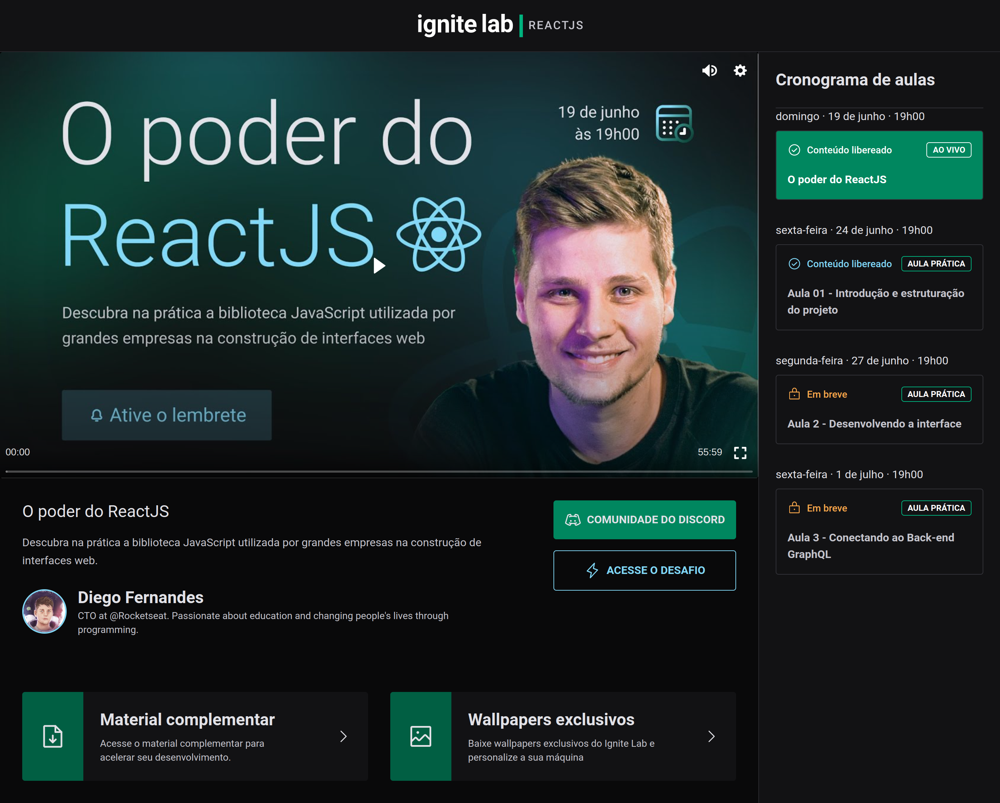
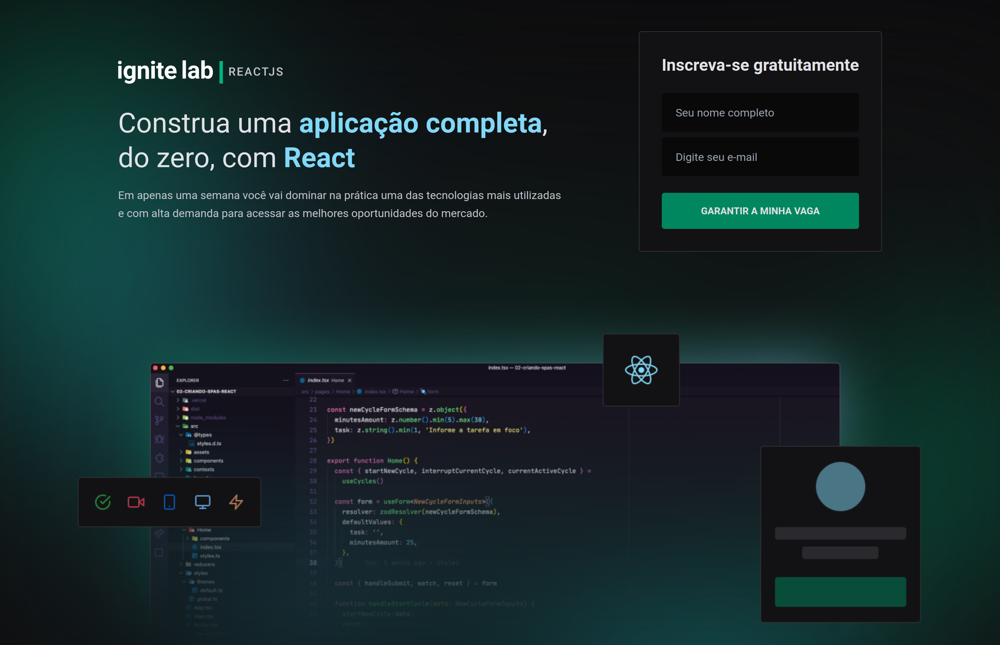

# Ignite Lab

O poder do ReactJS

## Sobre

Primeira realização do **Ignite Lab** da [Rocketseat](https://www.rocketseat.com.br/), um evento gratuito abordando alguns conteúdos e tecnologias utilizadas no seu programa de especialização chamado Ignite.

Desenvolvemos durante uma semana, uma aplicação para a realização de um evento online com disponibilização automática do conteúdo em vídeo de acordo com seu dia e horário registrado para liberação.

As tecnologias utilizadas para o desenvolvimento foram:

- [ReactJS](https://pt-br.reactjs.org/)
- [Vite](https://vitejs.dev/)
- [TypeScript](https://www.typescriptlang.org/)
- [TailwindCSS](https://tailwindcss.com/)
- [React Router Dom](https://reactrouter.com/)
- [VimeJs](https://vimejs.com/)
- [GraphQL](https://graphql.org/)
- [Apollo](https://www.apollographql.com/)
- [GraphCMS](https://graphcms.com/)

## Páginas da aplicação

- ### Início

  Apresentação e formulário de login
  

- ### Dashboard
  Acesso às aulas disponíveis  
  
